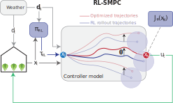

# Reinforcement Learning Stochastic Model Predictive Control (RL-SMPC) for Greenhouse Lettuce Production 🥬

## Introduction

This repository provides an implementation of the integration between **R**einforcement **L**earning and **S**tochastic **M**odel **P**redictive **C**ontrol (**RL-SMPC**) for controlling greenhouse lettuce production systems under parametric uncertainty. The RL-SMPC algorithm is visualized in the figure below.

<p align="center">
    
</p>


## Project Structure

The project is organized as follows:

```
RL-MPC-lettuce/
│
├── README.md
├── requirements.txt
├── configs/
│   ├── models/
│   └── envs/
├── common/
│   └── utils.py
├── data/
├── train_data/
├── RL/
│   ├── rl.py
│   └── evaluate_rl.py
├── mpc.py
└── rl_mpc.py
```

- **common/utils.py**: Defines the model's differential equations and parameters.
- **configs/models/**: Contains hyperparameters for control methods.
- **configs/envs/**: Contains additional environment parameters for the greenhouse system.

## Installation

This project was developed using Python 3.11 with in an Anaconda environment.

1. Clone the repository:
```shell
git clone git@github.com:BartvLaatum/RL-MPC-lettuce.git
```

2. Install the required Python libraries:
```shell
pip install -r requirements.txt
```

## Usage

## Experiments

The [`experiments`](./experiments/) folder contains experiments to run (S)MPC and RL-SMPC for varying prediction horizons. We have created some bash scripts to easily set some command line arguments [`run_scipts`](./run_scripts/). In detail:

#### Training an RL-agent
Trains the Soft Actor-Critic (SAC) agent 
```
. run_scripts train_stoch_rl.sh
```

## Visualizations


#### Compare the performance of RL-SMPC, SMPC, MPC and RL over the prediction horizon

```shell
python visualisations/rl_smpc_performance.py --project SMPC --model_names frosty-rain-50 --smpc --zero-order --terminal --mode stochastic --uncertainty_value 0.15 --figure_name warm-start
```

<!-- ## Results

### Deterministic case
Example performance of varying horizons in the RL-MPC framework:


### Stochastic case
Example performance of varying horizons in the RL-MPC framework:

 -->

