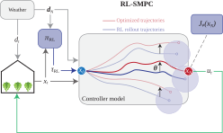
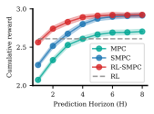
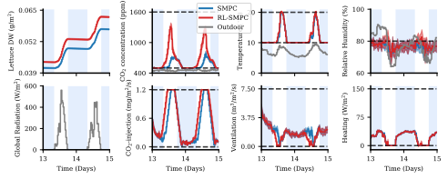
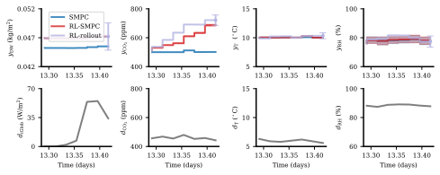
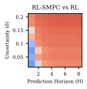

# Reinforcement Learning and Stochastic Model Predictive Control (RL-SMPC) for Greenhouse Lettuce Production 🥬

## Introduction

This repository provides an implementation of the integration between **R**einforcement **L**earning and **S**tochastic **M**odel **P**redictive **C**ontrol (**RL-SMPC**) for controlling greenhouse lettuce production systems under parametric uncertainty. The RL-SMPC algorithm is visualized in the figure below.
<p align="center">
<br/><br/>

<br/><br/>
</p>

The code in this repository was used for our paper published in the [Control Engineering Practice](https://www.sciencedirect.com/journal/control-engineering-practice) journal. A link to this article is available below.

📄 Paper: [Stochastic model predictive control with reinforcement learning for greenhouse production systems under parametric uncertainty](https://doi.org/10.1016/j.conengprac.2026.106787).

✏ author: Bart van Laatum

📧 e-mail: bart.vanlaatum@wur.nl

## Prerequisites

Before installing this project, ensure you have:

- And virtual environment with **Python==3.11** (recommended to use Anaconda/Miniconda)
- **Weights & Biases (wandb) account** (free tier sufficient)
  - Create an account at [wandb.ai](https://wandb.ai)
  - After installation, run `wandb login` and enter your API key
  - The training scripts use wandb to log experiments and assign unique model names

## Installation

This project was developed using Python 3.11 with in an Anaconda environment. It is recommended to create a virtual conda/python environment for this project.

1. Clone the repository:
```shell
git clone git@github.com:BartvLaatum/RL-SMPC.git
```

2. Install the required Python libraries:
```shell
pip install -r requirements.txt
```

## Project Structure

The project is organized as follows:

```
RL-MPC-lettuce/
│
├── common/
├── configs/
├── envs/
├── experiments/
├── RL/
├── run_scripts/
├── visualizations/
├── weather/
├── README.md
├── requirements.txt
├── mpc.py
├── smpc.py
└── rl_smpc.py
```

- **configs/**: Contains parameters for greenhouse system and hyperparameters for control methods, i.e., SAC and (S)MPC
- **common/**: Contains scripts with helper functions and classes for modelling, training, results saving etc.
- **envs/**: Scripts for reinforcement learning environments, including observation space
- **experiments/**: Python scripts for running experiments
- **RL/**: Contains Python scripts to evaluate, train RL models and learn terminal cost functions
- **Visualisations/**: Scripts for visualizations
- **weather/**: Contains weather data in csv format
- ***{\*}mpc.py***: Contains the classes that define the various MPC controllers. Additionally, contain experiments manager classes for results tracking and saving. 


## Complete Workflow Overview

This section explains the complete workflow for using RL-SMPC. The typical workflow follows these stages:


1. **Training**: Train RL policies, and value functions under parametric uncertainty
2. **Evaluation**: Evaluate RL, MPC, SMPC, and RL-SMPC methods
3. **Visualization**: Generate plots and figures

<!-- All the mentioned experiments in our [paper](arxiv.com) can be executed via bash scripts in the `run_scripts/` folder. -->
## Usage: Step-by-Step Guide

To run RL-SMPC, you first need to train an RL policy and learn a value function. Next, you can run RL-SMPC for various prediction horizons.
Here's the typical workflow.

#### 1. **Train RL Models** for multiple uncertainty levels
```shell
   ./run_scripts/train_stoch_rl.sh
```

**This script:**
- Trains RL agents for 8 different parametric uncertainty levels
- Models saved to train_data/SMPC/models with wandb-generated names
- After completion, note the wandb model names (e.g., ruby-serenity-1, brisk-resonance-2, etc.)

#### 2. **Update model names** in the [run_scripts/execute_all.sh](run_scripts/execute_all.sh)

Open run_scripts/execute_all.sh and update line 15-18 with YOUR trained model names:

```shell
   MODEL_NAMES=(
       "YOUR-MODEL-1", "YOUR-MODEL-2", "YOUR-MODEL-3", "YOUR-MODEL-4",
       "YOUR-MODEL-5", "YOUR-MODEL-6", "YOUR-MODEL-7", "YOUR-MODEL-8"
   )
```

#### 3. **Run full evaluation piple for all methods**
```shell
   ./run_scripts/execute_all.sh
```

**This script:**
- Evaluates RL agents on the evaluation environment
- Trains value functions for RL-SMPC
- Evaluates MPC, SMPC, and RL-SMPC across 8 horizons (1H-8H) with 10 random seeds
- Output: Results saved to Results/uncertainty-comparison/
- Duration: Multiple days (highly dependent on hardware)

___

### Option B: Quick start with single uncertainty level

For faster testing or custom experiments with a single uncertainty level:

1. Train an RL Policy
Edit [run_scripts/train_stoch_rl.sh](run_scripts/train_stoch_rl.sh) to train for a single uncertainty level:
```shell
# In train_stoch_rl.sh, modify line 13:
uncertainty_values=(0.1)  # Train only for 10% uncertainty
# In train_stoch_rl.sh, modify line 13:uncertainty_values=(0.1)  # Train only for 10% uncertainty
```
Then run:
```shell
./run_scripts/train_stoch_rl.sh
```

2. Train value function and evaluate RL
Update the model name and match uncertainty value in [run_scripts/train_vf.sh](run_scripts/train_vf.sh)

Next, run the script
```shell
./run_scripts/train_vf.sh
```

- This trains the terminal value function 
- Evaluates the RL agent
- Output: Terminal value function saved to train_data/SMPC/models/<MODEL_NAME>

3. Evaluate RL-SMPC:
Update the model name and uncertainty value in [run_scripts/rl_smpc.sh](run_scripts/rl_smpc.sh):

```shell
./run_scripts/rl_smpc.sh
```

- Executes RL-SMPC for the 8 different horizons (1-8 Hours)
- Output: Results saved to `data/SMPC/stochastic/rlsmpc/`

4. Evaluate MPC and SMPC baselines
Run:
```shell
./run_scripts/smpc.sh
```
Executes both MPC and SMPC for 8 prediction horizons.

**Ablation Study**:
```shell
./run_scripts/ablation.sh
```
Executes the RL-SMPC algorithm while ablating the algorithm's three main components one at a time.

___

Finally, we can make pre-trained RL policies and value function available upon request.

## Visualizations

All visualization scripts are in the `visualisations/` directory. They read experiment results and generate figures.

**Prerequisites:** Before generating visualizations, you must have:
1. Completed training (Step 1 in Usage)
2. Run evaluation experiments (Steps 2-4 in Usage)
3. Results saved in `data/{PROJECT_NAME}/` directory


### 1. RL-SMPC Performance Plot (`visualisations/rl_smpc_performance.py`)

This script compares the performance of RL-SMPC, SMPC, MPC, and RL across different prediction horizons and uncertainty levels. It generates line plots showing cumulative rewards and other metrics.

**Example usage:**
```shell
python visualisations/rl_smpc_performance.py --project SMPC --model_names brisk-resonance-24 --smpc -mpc --zero-order --terminal --mode stochastic --uncertainty_value 0.1 --figure_name all-methods
```

**Example output:**

<p align="center">
  
</p>

---

### 2. State Trajectory Plot (`visualisations/plot_state_trajectory.py`)

This script visualizes the state trajectories of the greenhouse environment under different control strategies. It helps to analyze how the system evolves over time for each method.

**Example usage:**
```shell
python visualisations/plot_state_trajectory.py --project SMPC --model_name brisk-resonance-24 --mode stochastic --uncertainty_value 0.1
```

**Example output:**

<p align="center">
  
</p>

---

### 3. Open-Loop Solution Plot (`visualisations/OL_solution.py`)

This script plots the open-loop solution for a given scenario, showing the planned control actions and resulting state evolution without feedback.

**Example usage:**
```shell
python visualisations/OL_solution.py --project SMPC --model_name frosty-rain-50 --mode stochastic --uncertainty_value 0.15
```

**Example output:**

<p align="center">
  
</p>

---

### 4. Uncertainty Heatmap (`visualisations/uncertainty_heatmap.py`)

This script creates heatmaps comparing the relative performance of RL-SMPC versus MPC, SMPC and RL, across prediction horizons and uncertainty levels. It visualizes the relative performance differences as a color-coded matrix.

**Example usage:**
```shell
python visualisations/uncertainty_heatmap.py
```

**Example output:**

<p align="center">
  
</p>

---

# Citation
If you find this repository and/or its accompanying article usefull, please cite it in your publications.

```bibtex
@article{Laatum2026StochasticModelPredictiveControlwithRL,
  title = {Stochastic model predictive control with reinforcement learning for greenhouse production systems under parametric uncertainty},
  journal = {Control Engineering Practice},
  volume = {169},
  pages = {106787},
  year = {2026},
  issn = {0967-0661},
  doi = {https://doi.org/10.1016/j.conengprac.2026.106787},
  author = {Bart {van Laatum} and Salim Msaad and Eldert J. {van Henten} and Robert D. Mcallister and Sjoerd Boersma},
}
```