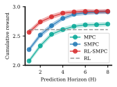
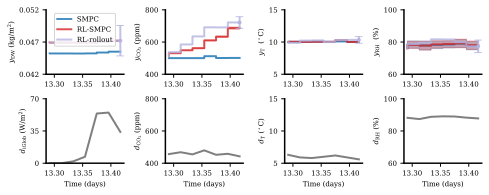

# Reinforcement Learning and Stochastic Model Predictive Control (RL-SMPC) for Greenhouse Lettuce Production 🥬

## Introduction

This repository provides an implementation of the integration between **R**einforcement **L**earning and **S**tochastic **M**odel **P**redictive **C**ontrol (**RL-SMPC**) for controlling greenhouse lettuce production systems under parametric uncertainty. The RL-SMPC algorithm is visualized in the figure below.
<p align="center">
<br/><br/>

<br/><br/>
</p>

The code in this repository was used for a paper under review at the [Control Engineering Practice](https://www.sciencedirect.com/journal/control-engineering-practice) journal. A link to a preprint for this article is available below.

📄 Preprint: https://arxiv.org/abs/2410.05336

✏ author: Bart van Laatum

📧 e-mail: bart.vanlaatum@wur.nl

## Project Structure

The project is organized as follows:

```
RL-MPC-lettuce/
│
├── common/
├── configs/
├── envs/
├── experiments/
├── RL/
├── run_scripts/
├── visualizations/
├── weather/
├── README.md
├── requirements.txt
├── mpc.py
├── smpc.py
└── rl_smpc.py
```

- **configs/**: Contains parameters for greenhouse system and hyperparameters for control methods, i.e., SAC and (S)MPC
- **common/**: Contains scripts with helper functions and classes for modelling, training, results saving etc.
- **envs/**: Scripts for reinforcement learning environments, including observation space
- **experiments/**: Python scripts for running experiments
- **RL/**: Contains Python scripts to evaluate, train RL models and learn terminal cost functions
- **Visualisations/**: Scripts for visualizations
- **weather/**: Contains weather data in csv format
- *{\*}mpc.py*: Contain the classes that define the various MPC controllers. Addtionally, contain experiments manager classes for results tracking and saving. 

## Installation

This project was developed using Python 3.11 with in an Anaconda environment. It is recommended to create a virtual conda/python environment for this project.

1. Clone the repository:
```shell
git clone git@github.com:BartvLaatum/RL-SMPC.git
```

2. Install the required Python libraries:
```shell
pip install -r requirements.txt
```

## Usage

All the mentioned experiments in our [paper](arxiv.com) can be executed via bash scripts in the `run_scripts/` folder.

To run RL-SMPC, you first need to train an RL policy and learn a value function. Here's the typical workflow:

#### 1. **Train RL Models**

Train RL models for various levels of parametric uncertainty. Users can adapt the uncertainty levels of the parametric uncertainty in this script themselves. This script creates a [wandb](wandb.ai) project and logs the trained agent. Additionally, the best and last tested model during training and their corresponding environments are saved to `train_data/{project}/` folder. 
```shell
   ./run_scripts/train_stoch_rl.sh
```

#### 2. **Evaluate all methods at once**
Run the full evaluation pipeline (execution can take several days)
```shell
   ./run_scripts/execute_all.sh
```
   This script evaluates the RL algorithm, trains the value function, and evaluates the closed-loop performance of MPC, SMPC, and RL-SMPC across 8 different horizons with 10 random seeds each.

> Note that you need to update the RL model names in the scripts yourself.

### Alternative Workflows

Instead of running all methods at once one can also execute them via separate bash scripts if preferred.

**Train Value Function Only**:
```shell
./run_scripts/train_vf.sh
```
This trains the value function and evaluates the RL agent.

**Evaluate RL-SMPC**:
```shell
./run_scripts/rl_smpc.sh
```
Executes RL-SMPC for the 8 different horizons.

**Evaluate MPC and SMPC**:
```shell
./run_scripts/smpc.sh
```
Executes both MPC and SMPC for 8 horizons.

**Ablation Study**:
```shell
./run_scripts/ablation.sh
```
Executes the RL-SMPC algorithm while ablating the three main components one at a time.

## Visualizations

This project provides several scripts for visualizing the performance and behavior of RL-SMPC, SMPC, MPC, and RL agents. Example usage and expected output for each script are described below.

> Note: Substitute in the correct paths to your saved results in the plot scripts. Also, replace the image paths with your actual figure outputs as needed. 

---

### 1. RL-SMPC Performance Plot (`visualisations/rl_smpc_performance.py`)

This script compares the performance of RL-SMPC, SMPC, MPC, and RL across different prediction horizons and uncertainty levels. It generates line plots showing cumulative rewards and other metrics.

**Example usage:**
```shell
python visualisations/rl_smpc_performance.py --project SMPC --model_names brisk-resonance-24 --smpc -mpc --zero-order --terminal --mode stochastic --uncertainty_value 0.1 --figure_name all-methods
```

**Example output:**

<p align="center">
  
</p>

---

### 2. State Trajectory Plot (`visualisations/plot_state_trajectory.py`)

This script visualizes the state trajectories of the greenhouse environment under different control strategies. It helps to analyze how the system evolves over time for each method.

**Example usage:**
```shell
python visualisations/plot_state_trajectory.py --project SMPC --model_name brisk-resonance-24 --mode stochastic --uncertainty_value 0.1
```

**Example output:**

<p align="center">
  
</p>

---

### 3. Open-Loop Solution Plot (`visualisations/OL_solution.py`)

This script plots the open-loop solution for a given scenario, showing the planned control actions and resulting state evolution without feedback.

**Example usage:**
```shell
python visualisations/OL_solution.py --project SMPC --model_name frosty-rain-50 --mode stochastic --uncertainty_value 0.15
```

**Example output:**

<p align="center">
  
</p>

---

### 4. Uncertainty Heatmap (`visualisations/uncertainty_heatmap.py`)

This script creates heatmaps comparing the relative performance of RL-SMPC versus MPC, SMPC and RL, across prediction horizons and uncertainty levels. It visualizes the relative performance differences as a color-coded matrix.

**Example usage:**
```shell
python visualisations/uncertainty_heatmap.py
```

**Example output:**

<p align="center">
  
</p>

---

# Citation

TO BE ANNOUNCED...